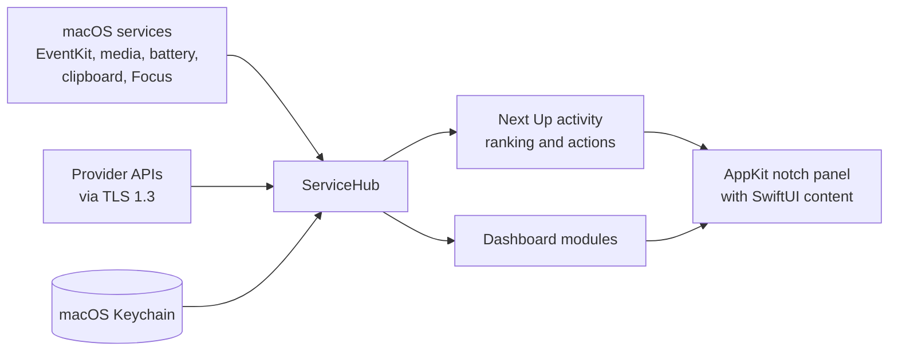

# NotchHub

A macOS notch-overlay app (MacNotch alternative). Its context-aware **Next Up** strip prioritizes imminent meetings, persistent timers, due reminders, media, Focus, and battery warnings; the compact dashboard adds live system, clipboard, RAM-cleaner, and AI Coding tools. The overlay yields to peer menu-bar utilities whenever it is collapsed. Built as a Swift Package, it runs as a lightweight menu-bar agent.

## Install

NotchHub requires macOS 14 or later on Apple Silicon.

### Recommended: build from source

This is the supported path. It takes about a minute and gives you full provenance.

```bash
git clone https://github.com/Srimi1/Notch-hub.git
cd Notch-hub
./scripts/build-app.sh          # builds and ad-hoc signs NotchHub.app
cp -R NotchHub.app /Applications/
open /Applications/NotchHub.app
```

### Pre-built DMG (unsigned — read this first)

A pre-built Apple Silicon DMG is attached to [the v0.1.0 pre-release](https://github.com/Srimi1/Notch-hub/releases). It is published as a **pre-release** on purpose: it is **ad-hoc signed and not Apple-notarized**, because this project has no Apple Developer Program identity yet. macOS Gatekeeper is *expected* to refuse it (`spctl` reports `rejected`), and overriding Gatekeeper means vouching for the binary yourself.

If you choose to use it:

1. Verify the SHA-256 checksum printed on the release page:
   `shasum -a 256 ~/Downloads/NotchHub-0.1.0-arm64.dmg`
2. Open the DMG and drag **NotchHub** to the **Applications** shortcut.
3. Launch it once, then open **System Settings → Privacy & Security**, scroll down, click **Open Anyway**, and confirm.

Read [Apple's guidance on opening apps from unidentified developers](https://support.apple.com/102445) before overriding Gatekeeper. If you would rather not, build from source instead — the result is identical.

The build scripts already support a signed, notarized release (`NOTCHHUB_SIGNING_IDENTITY` + `NOTCHHUB_NOTARY_PROFILE`); see [SECURITY.md](SECURITY.md#sandboxing-and-distribution).

## How it works



See [Architecture](docs/ARCHITECTURE.md) for the component map, startup sequence, data-flow, activity-ranking, credit-provider, and release-pipeline diagrams.

## Build & Run

Requires macOS + the Swift toolchain (Xcode or Command Line Tools).

```bash
# Build the release .app (ad-hoc signed) and launch it
./scripts/build-app.sh
open NotchHub.app

# Build and verify a drag-to-Applications DMG
./scripts/build-dmg.sh release

# Or install to /Applications, then launch from Spotlight
cp -R NotchHub.app /Applications/
```

For a distributable build, sign with a Developer ID and notarize:

```bash
xcrun notarytool store-credentials NotchHubNotary \
  --apple-id you@example.com --team-id TEAMID --password <app-specific-password>

export NOTCHHUB_SIGNING_IDENTITY="Developer ID Application: Your Name (TEAMID)"
export NOTCHHUB_NOTARY_PROFILE="NotchHubNotary"
./scripts/build-dmg.sh release        # signs, notarizes, staples, and verifies
```

Without those variables the scripts still work, but they say plainly that the output is ad-hoc signed and will not pass Gatekeeper elsewhere.

To start on login: click the **NotchHub** menu-bar icon → **Launch at Login**.

### Development

```bash
swift build          # debug build
swift test           # run the test suite
./scripts/check.sh   # full quality gate: build, tests, format, lint, concurrency
```

API-provider keys are stored in the macOS Keychain, never in `UserDefaults` or the repository. Calendar, Reminders, Apple Events, and notifications remain behind macOS permission prompts.
