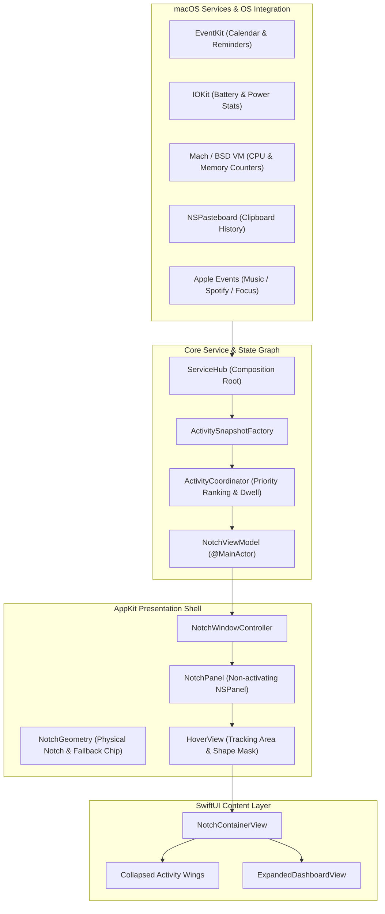
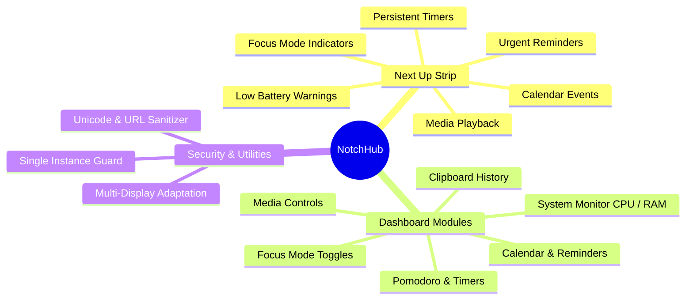
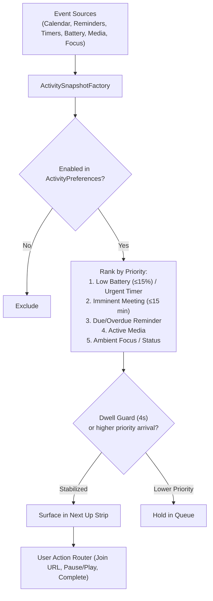
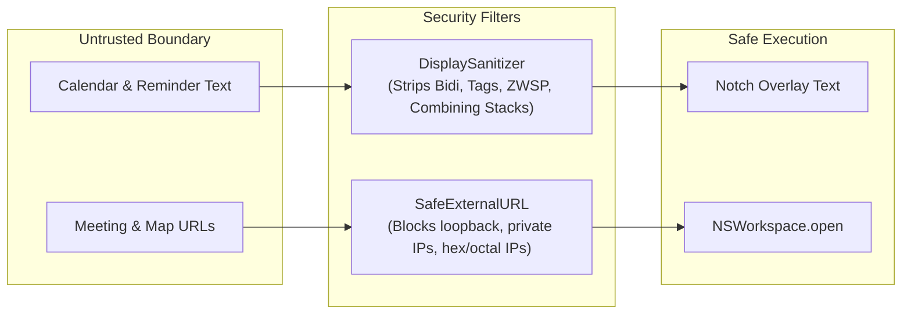

<p align="center">
  
</p>

<h1 align="center">NotchHub</h1>

<p align="center">
  <strong>Context-aware macOS Dynamic Island and Modular Dashboard for Apple Silicon Macs.</strong>
</p>

<p align="center">
  
  
  
  
  
</p>

---

## What is NotchHub?

**NotchHub** transforms the physical camera notch of modern MacBooks (and notchless external screens) into an interactive productivity surface. It combines an ambient, context-aware **Next Up activity strip** with a fast, lightweight **Expanded Dashboard** accessible on hover or via keyboard shortcut.

Built natively in Swift using AppKit for windowing and SwiftUI for rendering, NotchHub runs as a lightweight menu-bar accessory (`LSUIElement`) with zero Dock presence, no third-party telemetry, and zero cloud lock-in.

---

## Key Highlights

- ⚡ **Zero Friction Overlay:** Floats at status level (`NSPanel.Floating`) without ever stealing active keyboard focus or disrupting your workflow.
- 🎯 **Context-Aware Next Up Strip:** Intelligently arbitrates and surfaces imminent calendar meetings, running pomodoro/countdown timers, overdue reminders, media playback, focus modes, and critical battery warnings.
- 🛠️ **Modular Dashboard:** Seven modules, every one backed by a live service — Mach-level system vitals, media transport, calendar, reminders, timers, in-memory clipboard history, and Focus.
- 📋 **Copy Popup:** Copy anything and a Dynamic-Island-style box grows out of the notch — real file icon, name, and size. It slides away on its own, dismisses instantly on ⌘V when Accessibility is already granted, and file clips can be dragged straight out of it.
- 🔋 **Live Battery Glyph:** A drawn battery whose fill tracks the real charge and whose colour follows the system's own language — green on power, red when low, yellow in Low Power Mode. Reacts the instant the cable goes in.
- 🔒 **Asks Once:** Signed with a stable identity, so macOS privacy grants survive rebuilds. Nothing prompts on launch — every permission dialog traces to a button you pressed.
- 🛡️ **Nothing To Leak:** No network requests, no stored credentials, and no privileged code path. All calendar strings and external URLs pass through Unicode sanitizers and hostile URL/SSRF blockers.

---

## How It Works



### Architecture & Runtime Lifecycle
1. **AppKit Shell & Window Management:** `NotchWindowController` anchors a non-activating `NotchPanel` right over the hardware camera notch. On notchless or external displays, `NotchGeometry` calculates a floating rounded translucent chip.
2. **Two-Phase Service Activation:**
   - **Ambient Phase:** Starts immediately at launch for zero-permission stats (clock, CPU/RAM, battery, timers, clipboard).
   - **Interactive Phase:** Activated on first hover or menu toggle, deferring AppleScript or EventKit queries until needed to prevent premature permission popups.
3. **Reactive Ranking Engine:** `ActivityCoordinator` samples candidates from `ActivitySnapshotFactory`, applying a 4-second dwell filter to avoid rapid layout shifting while ensuring high-priority alerts immediately preempt lower ones.

---

## All Functions & Modules



### Implemented Feature Modules

| Module | Concrete View & Service | Description & Capabilities |
| :--- | :--- | :--- |
| **Next Up Strip** | [`ActivityCoordinator`](Sources/NotchHub/Core/ActivityCoordinator.swift) | Real-time wings on either side of the notch displaying active countdowns, imminent meeting join buttons, media titles, and battery warnings. |
| **Dashboard** | `DashboardModuleView` → [`SystemMonitorService`](Sources/NotchHub/Services/SystemMonitorService.swift) | Live Mach CPU load, memory-used percentage, clock, and a drawn [`BatteryGlyphView`](Sources/NotchHub/UI/BatteryGlyphView.swift) whose fill and colour track the real charge. |
| **Calendar** | `CalendarModuleView` → [`CalendarService`](Sources/NotchHub/Services/CalendarService.swift) | Surfaces events across connected calendars, provides 1-click launch for verified Zoom/Teams/Meet URLs, and displays location map previews. |
| **Todo & Reminders** | `ReminderModuleView` → [`ReminderService`](Sources/NotchHub/Services/ReminderService.swift) | Fetches reminders from EventKit with generation-token serialization and tombstone tracking to ensure completions never get undone by out-of-order responses. |
| **Pomodoro & Timers** | `TimerModuleView` → [`ActivityTimerService`](Sources/NotchHub/Services/ActivityTimerService.swift) | Up to 8 concurrent persistent countdown and focus timers that survive app restarts and Mac sleep/wake cycles. |
| **Media Player** | `MediaModuleView` → [`MediaService`](Sources/NotchHub/Services/MediaService.swift) | Full playback control and live track metadata for Apple Music and Spotify via non-intrusive AppleScript. |
| **Clipboard History** | `ClipboardModuleView` → [`ClipboardService`](Sources/NotchHub/Services/ClipboardService.swift) | In-memory stack of the 12 most recent clips (text, images, files) with instant copy-back; automatically ignores sensitive/password entries. |
| **Focus Controls** | `FocusModuleView` → [`FocusService`](Sources/NotchHub/Services/FocusService.swift) | Instant toggle and status display for macOS Do Not Disturb and Focus profiles via Control Center automation. |

---

## Live-Activity Prioritization Pipeline



---

## Comprehensive Security & Privacy



1. **No Network, No Credentials:** NotchHub makes no outbound network requests and stores no secrets. The only URLs it opens are meeting and map links you activate yourself, and they go through the validator below.
2. **Untrusted Input Sanitization ([`UntrustedInput.swift`](Sources/NotchHub/Core/UntrustedInput.swift)):**
   - Strips Unicode bidirectional overrides (`U+202A`–`U+2069`), default-ignorable characters, and runaway combining marks before rendering text in the overlay.
   - External URLs are strictly validated: non-HTTPS links and private/loopback IP addresses (including octal/hex variants) are rejected to prevent SSRF or arbitrary local handler execution.
3. **No Privilege Escalation:** NotchHub never asks for an administrator password and installs nothing outside its own bundle. Earlier versions offered an opt-in passwordless `sudo` rule for the RAM cleaner; both the cleaner and the rule are gone — see *Upgrading from v0.1.x* if you enabled it.

---

## Installation

### Prerequisites
- **macOS 14.0 (Sonoma) or later**
- **Apple Silicon Mac** (M1/M2/M3/M4)
- **Xcode or Swift Command Line Tools** (`xcode-select --install`)

### Build and Run from Source

```bash
# 1. Clone the repository
git clone https://github.com/Srimi1/Notch-hub.git
cd Notch-hub

# 2. Build the release .app (signed with your Apple Development cert if you have one)
./scripts/build-app.sh release

# 3. Copy to Applications and launch
cp -R NotchHub.app /Applications/
open /Applications/NotchHub.app
```

> **Signing and permissions**
> `build-app.sh` signs with the first Apple Development or Developer ID
> certificate in your keychain, falling back to ad-hoc if you have none. This
> matters more than it sounds: an ad-hoc signature is regenerated on every
> build, so macOS treats each rebuild as a brand-new app and throws away your
> Calendar and Reminders grants — which is what makes an app seem to ask for
> permission endlessly. A stable identity makes each grant a one-time answer.
> Override with `export NOTCHHUB_SIGNING_IDENTITY="…"`.

> **Why distributed as source?**  
> NotchHub is distributed as source for full auditability and provenance. When built locally on your machine, macOS will run the resulting binary without Gatekeeper quarantine blocks.

### Build Drag-to-Applications DMG

```bash
# Build and verify a release disk image
./scripts/build-dmg.sh release
```

---

## Upgrading from v0.1.x

The RAM cleaner, the AI coding monitor, and the AI credit tracker were removed.
NotchHub clears the API keys the credit tracker stored the first time the new
version launches, so there is nothing to do there.

The one thing it **cannot** remove for you is the optional passwordless `sudo`
rule the RAM cleaner offered, because deleting a root-owned file needs an
administrator password — and a release whose point is removing the privileged
code path should not ask you for one. If you enabled it, remove it yourself:

```bash
# Check whether the old rule is still installed (prints the path if it is)
sudo --non-interactive --list /usr/sbin/purge

# Remove it
sudo rm -f /etc/sudoers.d/notchhub
```

---

## Uninstall

To cleanly and completely uninstall NotchHub:

```bash
# 1. Quit NotchHub and delete application
rm -rf /Applications/NotchHub.app

# 2. Remove application preferences
defaults delete com.notchhub.app

# 3. Remove the passwordless purge rule left by v0.1.x (if you enabled it)
sudo rm -f /etc/sudoers.d/notchhub

# 4. Remove any API keys left by the v0.1.x credit tracker
security delete-generic-password -s com.notchhub.apikeys 2>/dev/null
```

---

## Development & Quality Gate

NotchHub uses SwiftPM, SwiftTesting (`import Testing`), SwiftLint, and SwiftFormat.

```bash
# Run debug build
swift build

# Run unit tests (102 tests across 24 suites)
swift test

# Run full repository quality gate (build, test compile, format, lint, concurrency)
./scripts/check.sh

# Apply code formatting
swift package --disable-sandbox --allow-writing-to-package-directory swiftformat Sources Tests
```

---

## License

This project is licensed under the [Apache License 2.0](LICENSE).

