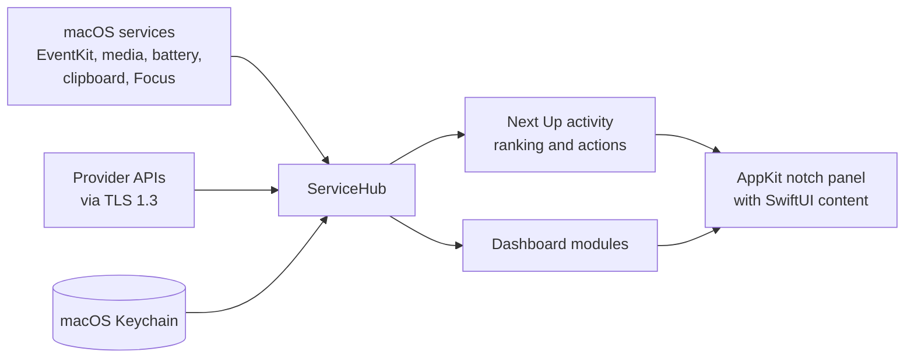

# NotchHub

A macOS notch-overlay app (MacNotch alternative). Its context-aware **Next Up** strip prioritizes imminent meetings, persistent timers, due reminders, media, Focus, and battery warnings; the compact dashboard adds live system, clipboard, RAM-cleaner, and AI Coding tools. The overlay yields to peer menu-bar utilities whenever it is collapsed. Built as a Swift Package, it runs as a lightweight menu-bar agent.

## Install

**NotchHub is distributed as source.** There is deliberately no pre-built download.

Requires **macOS 14 or later** on **Apple Silicon** (the build is `arm64`; Intel Macs are not supported).

```bash
git clone https://github.com/Srimi1/Notch-hub.git
cd Notch-hub
./scripts/build-app.sh          # builds and ad-hoc signs NotchHub.app
cp -R NotchHub.app /Applications/
open /Applications/NotchHub.app
```

That takes about a minute and gives you full provenance — you compiled the binary you're running.

### Why there is no download

A binary built here can only be **ad-hoc signed**, because the project has no Apple Developer Program identity. macOS Gatekeeper refuses ad-hoc-signed apps that arrive by download (`spctl` reports `rejected`), so a DMG would ask every user to override Gatekeeper and vouch for a binary they cannot verify. Shipping source avoids asking anyone to do that.

An app you build yourself is never quarantined, so this path has none of those problems.

The build scripts already support a properly signed, notarized release — set `NOTCHHUB_SIGNING_IDENTITY` and `NOTCHHUB_NOTARY_PROFILE` and `./scripts/build-dmg.sh release` will sign with the hardened runtime, notarize, staple, and verify. A binary release will be published once a Developer ID identity is available. See [SECURITY.md](SECURITY.md#sandboxing-and-distribution).

## How it works



See [Architecture](docs/ARCHITECTURE.md) for the component map, startup sequence, data-flow, activity-ranking, credit-provider, and release-pipeline diagrams.

## Build & Run

Requires macOS + the Swift toolchain (Xcode or Command Line Tools).

```bash
# Build the release .app (ad-hoc signed) and launch it
./scripts/build-app.sh
open NotchHub.app

# Build and verify a drag-to-Applications DMG (for your own use)
./scripts/build-dmg.sh release

# Or install to /Applications, then launch from Spotlight
cp -R NotchHub.app /Applications/
```

For a distributable build, sign with a Developer ID and notarize:

```bash
xcrun notarytool store-credentials NotchHubNotary \
  --apple-id you@example.com --team-id TEAMID --password <app-specific-password>

export NOTCHHUB_SIGNING_IDENTITY="Developer ID Application: Your Name (TEAMID)"
export NOTCHHUB_NOTARY_PROFILE="NotchHubNotary"
./scripts/build-dmg.sh release        # signs, notarizes, staples, and verifies
```

Without those variables the scripts still work, but they say plainly that the output is ad-hoc signed and will not pass Gatekeeper elsewhere.

To start on login: click the **NotchHub** menu-bar icon → **Launch at Login**.

### Development

```bash
swift build          # debug build
swift test           # run the test suite
./scripts/check.sh   # full quality gate: build, tests, format, lint, concurrency
```

API-provider keys are stored in the macOS Keychain, never in `UserDefaults` or the repository. Calendar, Reminders, Apple Events, and notifications remain behind macOS permission prompts.
