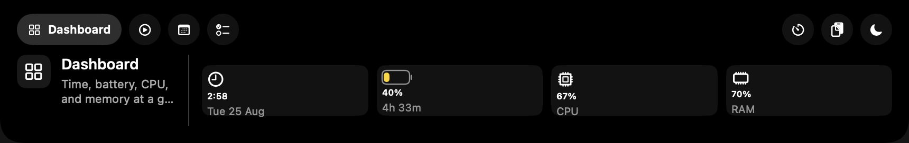
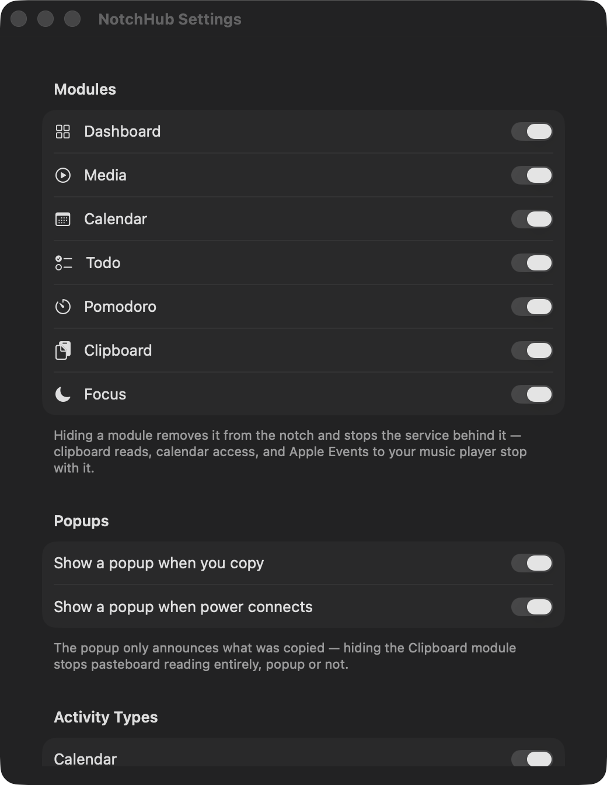

<div align="center">
  
  <h1>NotchHub</h1>
  <p><strong>The MacBook notch, put to work.</strong></p>
  <p>A native, local-first productivity surface for meetings, reminders, timers, media, clipboard history, Focus, battery, and system status.</p>

  <p>
    <a href="https://github.com/Srimi1/Notch-hub/actions/workflows/ci.yml"></a>
    <a href="https://github.com/Srimi1/Notch-hub/tags"></a>
    
    
    <a href="LICENSE"></a>
  </p>
</div>

<p align="center">
  
</p>
<p align="center"><sub>NotchHub running on a MacBook with a physical display notch.</sub></p>

NotchHub lives at the top edge of macOS. At rest, it blends into the camera notch and surfaces only the activity that matters next. Hover over it to open a compact dashboard, or use the menu-bar command to keep the dashboard open while you work.

Everything runs on the Mac. There is no NotchHub account, backend, telemetry SDK, cloud sync, or in-app network client. On a display without a physical notch, the same interface appears as a small floating chip.

## Contents

- [Why NotchHub](#why-notchhub)
- [Product tour](#product-tour)
- [Modules](#modules)
- [Next Up](#next-up)
- [How it works](#how-it-works)
- [Privacy and permissions](#privacy-and-permissions)
- [Requirements](#requirements)
- [Install](#install)
- [First run](#first-run)
- [Settings and defaults](#settings-and-defaults)
- [Build, test, and package](#build-test-and-package)
- [Upgrade from 0.1](#upgrade-from-01)
- [Uninstall](#uninstall)
- [Current boundaries](#current-boundaries)
- [Contributing](#contributing)

## Why NotchHub

The top edge of a MacBook is useful precisely because it is always visible. NotchHub turns that narrow strip into a calm layer for short-lived information, then expands only when you ask for more.

| Principle | What it means in the app |
| --- | --- |
| **Quiet by default** | Ambient information stays hidden until it becomes useful. Higher-priority activity can appear beside the notch without opening a window. |
| **One glance, then back to work** | Meetings, due reminders, timers, battery warnings, playback, and Focus share one ranked Next Up queue. |
| **Native behavior** | AppKit owns the top-edge panel and SwiftUI renders the interface. The app has no Dock icon and follows macOS Spaces and full-screen windows. |
| **Local data** | Clipboard history stays in memory. Timer and preference state stays in `UserDefaults`. Calendar and reminder data remains on the Mac. |
| **Useful on every display** | A physical MacBook notch is preferred. Notchless and external displays receive a compact fallback chip. |

## Product tour

NotchHub has three presentation layers. Each one is sized for a different kind of interruption.

| Layer | Purpose | How it appears | How it closes |
| --- | --- | --- | --- |
| **Collapsed** | A minimal notch with optional live activity wings | Always present on the chosen display; wings appear for ranked, non-ambient activity | Returns to the bare notch when no actionable activity remains |
| **Transient HUD** | Copy feedback, power connection, or a clipboard preview | Triggered by the related local event; copy HUD lasts 4 seconds, power HUD lasts 2.5 seconds | Times out, closes when the pointer leaves, or promotes into the dashboard when selected |
| **Expanded dashboard** | Full access to all visible modules | Hover over the notch, sustain a clipboard preview, or choose **Toggle Notch** from the menu bar | Move the pointer away, press <kbd>Esc</kbd> from an activity detail, or use **Toggle Notch** again |

The expanded dashboard is 860 points wide when space permits and automatically shrinks to fit the display. Reduced Motion is respected: major transitions simplify, and the clipboard preview tier is skipped so the dashboard opens directly.

## Modules

Seven built-in modules cover the day-to-day information NotchHub can read locally. Module visibility and the last selected module persist between launches.

| Module | What it shows | What you can do | Important limits |
| --- | --- | --- | --- |
| **Dashboard** | Clock, date, battery on portable Macs, CPU load, and memory use | Read a compact system overview | Disk usage is sampled internally but is not displayed |
| **Media** | Current title, artist, and player for whatever is playing, including browser tabs and web apps such as YouTube Music | Previous, play or pause, and next | No artwork or album view |
| **Calendar** | Up to six upcoming events from the next two days | Join a supported event URL, open a location in Apple Maps, or open Calendar | Full Calendar access is opt-in; all-day events do not enter Next Up |
| **Todo** | Up to eight incomplete reminders, including undated reminders | Mark a reminder complete | No reminder creation or editing; undated reminders do not enter Next Up |
| **Pomodoro** | Persistent 5, 15, 25, and 45 minute presets | Start, pause, resume, or dismiss a timer | Up to eight timer records; the current UI has no custom duration or name |
| **Clipboard** | Up to 12 recent text, image, and file clips | Restore a clip (pasted straight into the app you were using when Accessibility is granted), open the picker with a global shortcut, clear history, inspect thumbnails, or drag a copied file out of its HUD | Session-only memory; up to four files from one copy event |
| **Focus** | Do Not Disturb state when it can be read | Toggle Do Not Disturb through Control Center | No named Focus profiles; toggling requires Accessibility permission, and the state reads as unknown until Control Center or Full Disk Access supplies it |

### Clipboard and power HUDs

Copy feedback grows directly from the notch. Text, images, and file URLs receive a compact preview; file clips include the native icon, name, type, and size. Hover pauses dismissal, and selecting the HUD opens the Clipboard module. If Accessibility permission already exists, pressing <kbd>⌘V</kbd> can dismiss the visible copy HUD. NotchHub never requests Accessibility solely for this behavior.

Connecting power produces a separate 2.5-second charging HUD. A charging event does not replace a copy HUD already on screen. Both HUDs are enabled by default and can be disabled independently.

## Next Up

Next Up turns six local data sources into a single stable activity queue: Calendar, Reminders, Timers, Battery, Media, and Focus. The coordinator keeps one current item plus up to four queued items. A higher-priority event appears immediately; an equal or lower-priority event waits for the four-second dwell period so the notch does not constantly reshuffle.

The decision path is short:

1. Each service publishes its current local state.
2. NotchHub sanitizes display text and turns useful changes into comparable activity candidates.
3. Your settings remove disabled activity types.
4. The remaining candidates are ordered by priority, date, and a stable identifier.
5. A candidate above the current item can preempt it. Equal or lower priority respects the dwell period.

### Priority model

| Level | Examples |
| --- | --- |
| **Critical** | A completed timer; battery at 10% or below |
| **Urgent** | A running timer with one minute left; a meeting in progress or within five minutes; a reminder due within five minutes or recently overdue; battery at or below the configured warning threshold |
| **Foreground** | Active media playback |
| **Normal** | A paused timer or active Focus state |
| **Ambient** | Ordinary battery or charging state that does not need a wing |

Expanding a non-ambient item opens its detail view with up to two relevant actions. Calendar actions can open a validated meeting link, Apple Maps, or Calendar. Reminder completion and media controls run only after an explicit user action. <kbd>Enter</kbd> triggers the primary action; <kbd>Esc</kbd> returns to the dashboard.

Default lead times are 15 minutes for Calendar and 30 minutes for Reminders. The battery warning threshold defaults to 20%. Each activity type, lead time, and the urgent-over-media rule can be changed in Settings.

## How it works

A launch creates one local service hub and one top-edge window. From there, five steps shape the experience:

1. **Place the surface.** NotchHub chooses the first display with a physical notch. If none exists, it places a compact fallback chip on the main or first available display. It can also attach the overlay when a display appears after a headless login launch.
2. **Start the right services.** Time, system, battery, Focus, and timer services begin with the app. Clipboard and Reminders run only while their modules are visible. Calendar and Media wait until the first interaction.
3. **Choose what matters.** Calendar events, reminders, timers, battery state, playback, and Focus become activity candidates. Preferences filter them; priority and dwell rules choose the current item.
4. **Use the smallest useful surface.** Ranked activity appears beside the collapsed notch. Copy and power events use the temporary HUD. Hover or the menu command opens the full dashboard.
5. **Act only on request.** Completing a reminder, controlling playback, toggling Focus, or opening a meeting, map, or calendar link requires a user action.

### Under the hood

`AppDelegate` owns the local services, overlay controller, menu-bar item, Settings window, launch-at-login controller, and single-instance guard. `NotchWindowController` owns the placement and size of the overlay.

The window is a non-activating AppKit panel at status-bar level. It joins all Spaces, can accompany full-screen windows, and does not create a normal Dock presence. The interface itself is SwiftUI, driven by observable local services and the ranked activity coordinator.

<details>
<summary><strong>Service cadence and lifecycle</strong></summary>

| Service | Cadence | Starts when | Stops when hidden |
| --- | --- | --- | --- |
| Time | Every second | App launch | No |
| System CPU and memory | Every 2 seconds | App launch | No |
| Battery | Every 30 seconds plus immediate power events | App launch | No |
| Timers | Every second while needed | App launch | No |
| Clipboard | Checks pasteboard changes every 0.25 seconds | App launch when the module is visible | Yes |
| Reminders | Every 60 seconds | App launch when the module is visible; authorization checks do not prompt | Yes |
| Calendar | Every 60 seconds plus EventKit changes | First interaction when the module is visible | Yes |
| Media | System playback streams continuously; Music and Spotify are polled every 2 seconds | System playback at app launch when the module is visible; Music and Spotify on first interaction | Only the Music/Spotify half |
| Focus | Best-effort initial read, then local changes | App launch | No |

Hiding a sensitive-service module stops Clipboard, Calendar, Reminders, or Media polling. Battery, system, Focus, time, and timer services remain available because they also support the overlay and shared controls.

</details>

## Privacy and permissions

NotchHub has no runtime backend, account system, analytics, advertising, remote configuration, or in-app HTTP client. The app can hand a user-selected meeting or map URL to the browser or Apple Maps; those external applications may then access the network.

| Capability | Local data access | Persistence or write behavior | Permission behavior |
| --- | --- | --- | --- |
| **System and battery** | Time, CPU counters, virtual-memory counters, battery and power state | No history is stored | No permission required |
| **Clipboard** | Text, image data, and up to four file URLs from a copy event | Maximum 12 entries in process memory; cleared when NotchHub quits | No macOS prompt; hiding Clipboard stops pasteboard reads |
| **Calendar** | Up to eight events from now through the start of the day two days ahead | Read-only in NotchHub | Full Calendar access is requested only after **Enable Calendar** |
| **Reminders** | Up to 50 incomplete reminders due through the next two days | Writes only when you choose to complete a reminder | Full Reminders access is requested only after **Enable Reminders** |
| **Media** | Track title, artist, playback state, and player name — from Music and Spotify over Apple Events, and from the system's own now-playing state for every other player | Sends local previous, play or pause, and next commands | The system-wide reader needs no permission and runs from launch, so the notch can show a track before you open anything; the Music/Spotify half waits for your first interaction, because its first scan can trigger the macOS Automation prompt |
| **Focus** | Best-effort Do Not Disturb state | UI-scripts Control Center only when you request a toggle | Accessibility must be granted manually; no named Focus profiles, and the state reads as unknown until a toggle or Full Disk Access supplies it |
| **Timers** | Timer title, duration, phase, and dates | Up to eight records in `UserDefaults`; local notification on completion | Notification access is requested when the first timer is created |
| **Launch at Login** | Login item registration status | Uses the macOS login-item service | Attempted once on first run, then controlled from Settings |

Clipboard entries carrying macOS concealed, transient, or autogenerated markers are ignored. This reduces the chance of retaining password-manager content, but no clipboard monitor can identify every sensitive value. Clipboard history is never written to disk by NotchHub.

Calendar, reminder, and timer strings pass through display sanitization before entering the overlay. External actions accept validated public HTTPS URLs and a small set of meeting-link schemes. Validation does not claim to verify the meeting provider or resolve every hostname before the selected URL is handed to macOS.

The app is not App Sandbox enabled. Identity-signed builds use the hardened runtime and the Apple Events automation entitlement; ad-hoc local builds omit that entitlement path. NotchHub does not request administrator access.

## Requirements

- macOS 14 Sonoma or later
- A Mac with a physical notch for the native placement; notchless and external displays use the fallback chip
- Apple Silicon is the currently tested configuration. The source does not hard-code an architecture requirement
- Git and Xcode, or the Swift command-line tools, when building from source

Install the command-line tools if needed:

```bash
xcode-select --install
```

## Install

The current release is **[0.3.2](https://github.com/Srimi1/Notch-hub/releases/latest)** — `NotchHub-0.3.2-universal.dmg`, a universal build that runs on both Apple Silicon and Intel.

That download is signed with an Apple Development certificate under the hardened runtime, but it is **not notarized**, so Gatekeeper refuses it on a Mac that did not build it. Approve it once under **System Settings ▸ Privacy & Security ▸ Open Anyway**, or — the route this project recommends — build from source, which takes about a minute and gives you full provenance:

```bash
git clone https://github.com/Srimi1/Notch-hub.git
cd Notch-hub

./scripts/build-app.sh release
cp -R NotchHub.app /Applications/
open /Applications/NotchHub.app
```

The build script uses the first suitable Apple Development or Developer ID certificate in your keychain. If none is available, it falls back to ad-hoc signing. A stable signing identity helps macOS keep Calendar, Reminders, Automation, and Accessibility decisions across rebuilds.

To select an identity explicitly:

```bash
export NOTCHHUB_SIGNING_IDENTITY="Apple Development: Your Name (TEAMID)"
./scripts/build-app.sh release
```

## First run

1. Launch NotchHub. It appears in the menu bar and does not add a Dock icon.
2. Hover over the notch, or open the menu-bar item and choose **Toggle Notch**.
3. Open Settings with the menu command or <kbd>⌘,</kbd> while the menu is active.
4. Keep all seven modules, or hide the ones you do not want. Calendar, Reminders, Media, and Clipboard stop their local polling when hidden.
5. Enable Calendar and Reminders from their explicit access controls if you want those modules.
6. Starting the first timer can request Notifications. Interacting with Media while Music or Spotify is running can request Automation.
7. The first launch offers a permissions walkthrough, and Settings ▸ Permissions shows the same rows afterwards. Accessibility is what the Focus toggle and automatic pasting need; macOS grants it only by hand.

The menu also provides **Toggle Notch** with <kbd>⌘T</kbd> and **Quit NotchHub** with <kbd>⌘Q</kbd>. Those are application menu equivalents. The one system-wide shortcut is the clipboard picker, <kbd>⌘⇧Space</kbd> by default, which drops the clip list out of the notch from any app; Settings offers <kbd>⌃⌥V</kbd> and <kbd>⌘⇧V</kbd> instead, and <kbd>⌘Space</kbd> is unavailable because Spotlight owns it. Digits <kbd>1</kbd>–<kbd>9</kbd> pick from the picker and <kbd>Esc</kbd> closes it. Inside the interactive dashboard, <kbd>⌘1</kbd> through <kbd>⌘9</kbd> select visible modules.

## Settings and defaults

<p align="center">
  
</p>
<p align="center"><sub>The screenshot is a direct capture from the repository build. No Calendar, Reminders, Media, or clipboard content is shown.</sub></p>

| Setting | Default |
| --- | --- |
| Visible modules | Dashboard, Media, Calendar, Todo, Pomodoro, Clipboard, Focus |
| Next Up activity types | Calendar, Reminders, Timers, Battery, Media, Focus |
| Calendar lead time | 15 minutes, configurable from 5 to 60 |
| Reminder lead time | 30 minutes, configurable from 5 to 240 |
| Battery warning | 20%, configurable from 5% to 50% |
| Urgent activity over media | Enabled |
| Copy popup | Enabled |
| Power-connection popup | Enabled |
| Launch at Login | Registration is attempted once on first run, then remains user-controlled |

Preferences include module visibility, the last selected module, activity types and thresholds, popup choices, and launch-at-login state. Timer records also persist in `UserDefaults`. Clipboard content, media metadata, events, and reminder lists are not persisted by NotchHub.

## Build, test, and package

NotchHub is a Swift Package Manager executable. AppKit provides the application lifecycle and overlay window; SwiftUI provides the modules and activity surfaces. EventKit, IOKit, Security, ServiceManagement, SQLite3, Quick Look, User Notifications, Combine, and Observation provide the system integrations. SwiftFormat and SwiftLint are tooling dependencies only; the app has no third-party runtime package.

### Development commands

```bash
swift build
swift test
./scripts/check.sh
```

The full check builds the app and test targets, checks SwiftFormat, and reports strict-concurrency findings. With full Xcode selected, it also runs SwiftLint and the test suite; those two steps are skipped in a command-line-tools-only environment. Continuous integration repeats build, test compilation, formatting, linting, and tests on `macos-latest`.

Format the Swift sources:

```bash
swift package \
  --disable-sandbox \
  --allow-writing-to-package-directory \
  swiftformat Sources Tests
```

### Project map

```text
Notch-hub/
├── Sources/NotchHub/
│   ├── Core/          overlay state, geometry, activities, preferences
│   ├── Services/      Calendar, Reminders, Media, Clipboard, battery, timers
│   ├── UI/            dashboard modules, HUDs, activity detail, settings
│   ├── AppDelegate.swift
│   └── main.swift
├── Tests/NotchHubTests/
├── Resources/         app icon, bundle metadata, signing entitlement
├── scripts/           app, DMG, quality, and pre-push helpers
├── docs/
└── Package.swift
```

### Build a DMG

```bash
./scripts/build-dmg.sh release
```

The result is written to `dist/NotchHub-<version>-<arch>.dmg`. The script also supports `--output PATH` and `--skip-build`. Maintainers can provide `NOTCHHUB_SIGNING_IDENTITY` and `NOTCHHUB_NOTARY_PROFILE` to sign, submit, staple, validate, and checksum a distribution build.

## Upgrade from 0.1

NotchHub 0.2 removes the RAM cleaner, AI coding monitor, and AI credit tracker that existed in 0.1. On first launch, the current app performs a one-time cleanup of legacy API-key entries from Keychain.

Version 0.1 also offered an optional passwordless `sudo` rule for the former RAM cleaner. The current app cannot delete a root-owned rule without asking for administrator access, which it deliberately avoids. If you enabled that option, remove the old rule yourself:

```bash
sudo rm -f /etc/sudoers.d/notchhub
```

## Uninstall

1. Open NotchHub Settings and turn off **Launch at Login**.
2. Choose **Quit NotchHub** from the menu bar.
3. Move `/Applications/NotchHub.app` to the Trash.
4. Optionally remove saved preferences and timer state:

   ```bash
   defaults delete com.notchhub.app
   ```

5. If you used version 0.1, remove the legacy `sudo` rule shown above. The 0.2 migration normally removes old Keychain entries; the optional manual fallback is:

   ```bash
   security delete-generic-password -s com.notchhub.apikeys
   ```

## Current boundaries

- The app chooses the first physical-notch display. It does not yet include a screen picker or follow whichever display is active.
- Media reads Apple Music and Spotify over Apple Events, and everything else — browser tabs, web apps, Electron players — through a bundled copy of [mediaremote-adapter](https://github.com/ungive/mediaremote-adapter), which reads the system's own now-playing state. That path relies on a private framework Apple has broken before; if it stops working NotchHub falls back to Music and Spotify rather than failing. Browser playback is labelled with the app macOS reports, so a YouTube Music tab in Safari reads as "Safari" while the installed web app reads as "YouTube Music". Artwork and album presentation are not part of the current UI.
- Focus controls Do Not Disturb only. Without Full Disk Access the state is read back from Control Center after a toggle, and is shown as unknown until then rather than guessed; changes made outside NotchHub can still be stale.
- Calendar links are syntax-validated and user-initiated. NotchHub does not show map previews or certify that a link belongs to a particular meeting provider.
- Clipboard history lasts for the current process and clears on quit. Sensitive-content markers are honored when the source application supplies them.
- Timer presets are fixed at 5, 15, 25, and 45 minutes in the current UI.
- Published builds are universal (`arm64` + `x86_64`). Apple Silicon is what the app is developed and tested on; the Intel slice is built and signed but has not been exercised on Intel hardware.

## Contributing

Contributions are welcome. Read [CONTRIBUTING.md](CONTRIBUTING.md) before opening a pull request, review the [changelog](CHANGELOG.md), and follow the [Code of Conduct](CODE_OF_CONDUCT.md). Please report vulnerabilities through the process in [SECURITY.md](SECURITY.md), not through a public issue.

NotchHub is available under the [Apache License 2.0](LICENSE).
