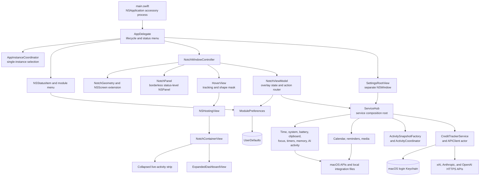
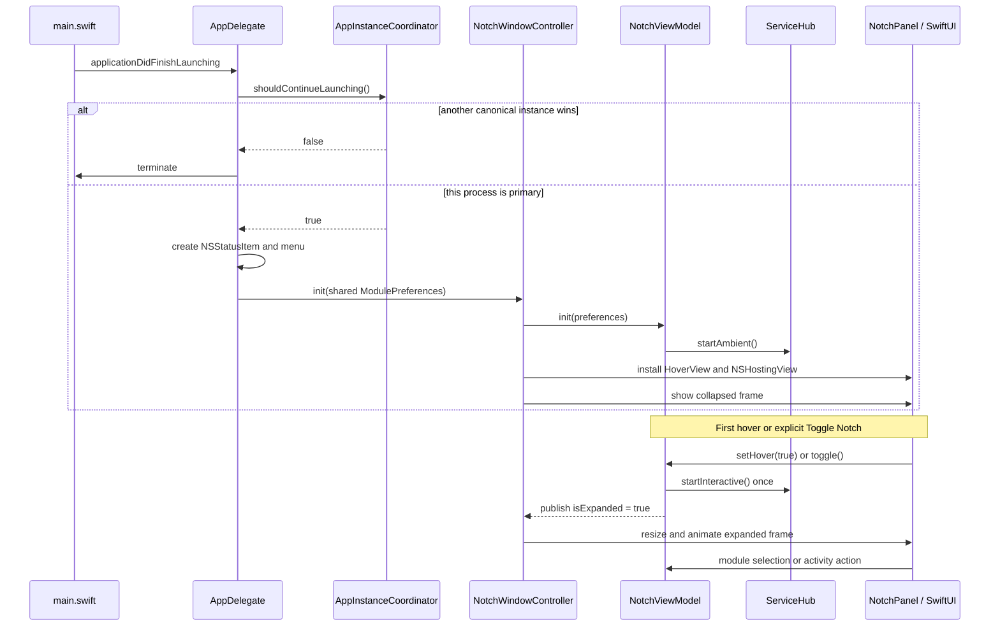
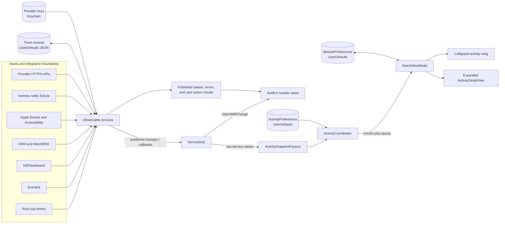
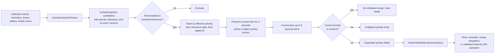
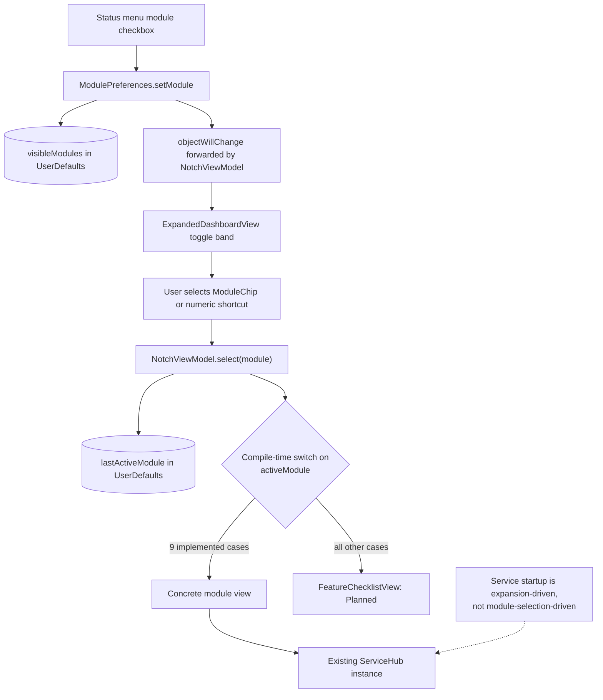
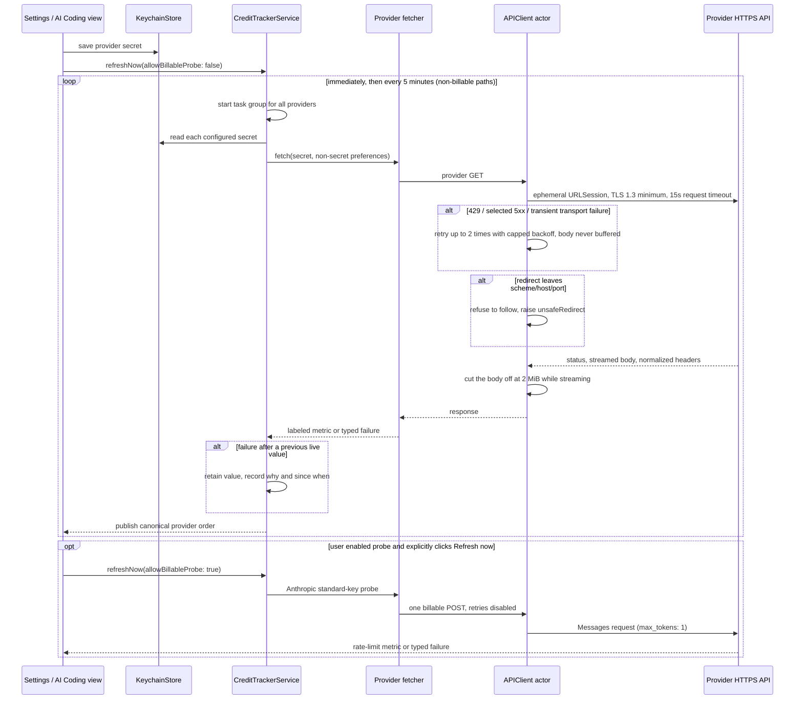
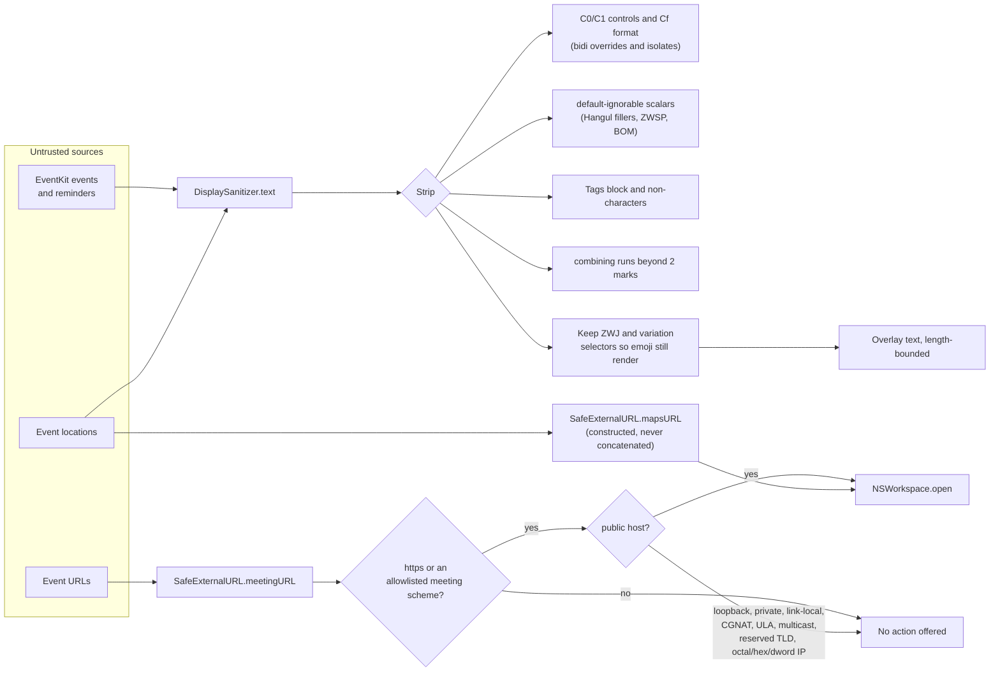
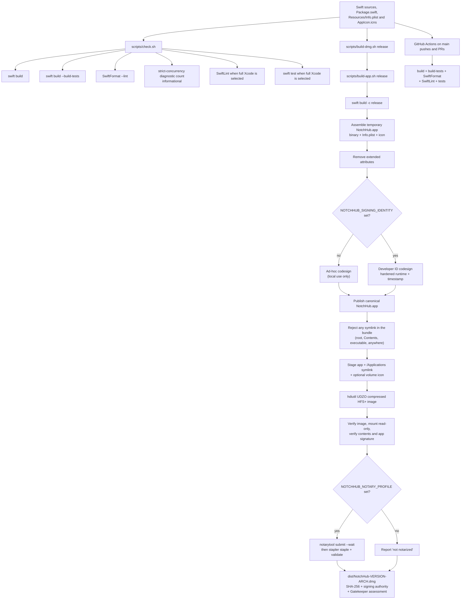

# NotchHub architecture

This document describes the code that exists in the repository today. NotchHub is a single-process macOS 14 accessory app built as a Swift Package executable. AppKit owns the application, menu bar item, overlay panel, and window geometry; SwiftUI renders the overlay and settings; a shared service graph supplies live state.

The most useful source-of-truth entry points are:

- [`Package.swift`](../Package.swift) — package, platform, targets, and build-tool plugins.
- [`main.swift`](../Sources/NotchHub/main.swift) and [`AppDelegate.swift`](../Sources/NotchHub/AppDelegate.swift) — process and application lifecycle.
- [`NotchWindowController.swift`](../Sources/NotchHub/Core/NotchWindowController.swift) and [`NotchViewModel.swift`](../Sources/NotchHub/Core/NotchViewModel.swift) — overlay composition and interaction state.
- [`ServiceHub.swift`](../Sources/NotchHub/Services/ServiceHub.swift) — live-service composition root.
- [`ExpandedDashboardView.swift`](../Sources/NotchHub/UI/ExpandedDashboardView.swift) — compile-time feature-module dispatch.
- [`UntrustedInput.swift`](../Sources/NotchHub/Core/UntrustedInput.swift) — the single gate for text and URLs authored outside the app.
- [`APIClient.swift`](../Sources/NotchHub/Services/APIClient.swift) — the only outbound network path, and the credential-safety rules that govern it.

## Runtime component map



### Layer responsibilities

| Layer | Main types | Responsibility |
| --- | --- | --- |
| Process lifecycle | `main.swift`, `AppDelegate`, `AppInstanceCoordinator` | Starts an accessory app, prevents duplicate overlays, builds the menu bar menu, opens settings, manages launch-at-login, and reacts to display changes. |
| AppKit shell | `NotchWindowController`, `NotchPanel`, `HoverView`, `NotchGeometry` | Hosts SwiftUI in a non-activating, always-on-top panel; computes physical-notch or fallback dimensions; tracks hover; animates between collapsed and expanded frames. |
| Presentation state | `NotchViewModel`, `ModulePreferences`, activity model types | Owns expansion, selected module, live-activity presentation, user actions, and persisted module layout. |
| SwiftUI | `NotchContainerView`, `ExpandedDashboardView`, module/detail/settings views | Renders collapsed wings, the selected dashboard module, activity actions, and preferences. Views receive state and call explicit service/view-model operations. |
| Service graph | `ServiceHub` and `Services/*` | Owns polling and OS integrations, republishes child changes, and converts raw service state into activity candidates. |
| Network boundary | `CreditTrackerService`, provider fetchers, `APIClient` | Reads provider keys from Keychain, fetches provider-specific metrics concurrently, refuses cross-origin redirects, caps streamed response bodies, retries transient HTTP failures, and preserves stale last-good values (with a reason and an age) when refreshes fail. |
| Hostile-input boundary | `DisplaySanitizer`, `SafeExternalURL` (`Core/UntrustedInput.swift`) | Normalizes text that arrives from other applications before it reaches the overlay, and classifies external URLs before they reach `NSWorkspace.open`. |
| Permission state | `EventKitAccessDecision` (`Core/EventKitAccess.swift`) | Single testable mapping from `EKAuthorizationStatus` to grant/deny/prompt, shared by `CalendarService` and `ReminderService`. |

## Startup and overlay lifecycle

There is no SwiftUI `App` entry point. `main.swift` creates `NSApplication`, selects `.accessory` activation, assigns `AppDelegate`, and enters the AppKit run loop. `LSUIElement` is also set in `Resources/Info.plist`, so the app has no normal Dock presence.



`AppInstanceCoordinator` prefers a running canonical `NotchHub.app`, then compares bundle versions, modification dates, and process IDs. The primary process retires duplicate processes with the same bundle identifier; a losing process exits before creating UI.

`NotchWindowController` keeps the actual panel no larger than its visible content. On a notched display, `NotchGeometry` derives the camera width from the two auxiliary menu-bar areas and uses the safe-area inset as height. Notchless/external displays use a 190 × at-least-32 point fallback. Expanded width is capped to the screen width minus 40 points.

## Service lifecycle and observation

`NotchViewModel` creates one `ServiceHub`. The hub creates every service once, wires their change callbacks, and separates startup into two phases:

- **Ambient:** starts during `NotchViewModel.init` and does not wait for the panel to expand.
- **Interactive:** starts once, on the first hover expansion or explicit menu toggle, because media automation and Calendar can trigger permission prompts.

| Service | Phase / cadence | Data source and output |
| --- | --- | --- |
| `TimeService` | Ambient, 1 second | Current time/date for the dashboard and collapsed clock. |
| `SystemMonitorService` | Ambient, 2 seconds | Mach/BSD CPU and VM counters plus home-volume capacity. |
| `BatteryService` | Ambient, 30 seconds | IOKit power-source state and estimates. |
| `ClipboardService` | Ambient, 1 second | `NSPasteboard`; holds up to 12 text/image/file entries in memory and ignores concealed/transient markers. |
| `FocusService` | Ambient initial read; actions on demand | Accessibility-driven Control Center AppleScript, with a best-effort read of the TCC-protected DND assertions file. |
| `AICodingService` | Ambient, 2 seconds | Read-only polling of `~/.cache/hermes-notify/state.db`; writes an approval response JSON only when the user chooses Allow/Deny. |
| `ActivityTimerService` | Ambient, 1 second | Up to eight timers, JSON-encoded in `UserDefaults`, with `UNUserNotificationCenter` completion notifications. |
| `ReminderService` | Ambient, 60 seconds when already authorized | EventKit reminders. It re-reads authorization each tick (and on app activation) without prompting; `requestAccess()` is an explicit user action. Reloads are generation-guarded and completions are tombstoned by generation. |
| `CreditTrackerService` | Ambient, immediate then 5 minutes | Concurrent provider fetches through `APIClient`; keys come from Keychain. |
| `PurgePrivilege` / `MemoryCleanerService` | Probe at launch; clean on demand | Mach VM counters and an explicitly elevated `/usr/sbin/purge` operation. |
| `MediaService` | Interactive, 2 seconds | Apple Events/AppleScript against Music or Spotify; transport actions use the same channel. |
| `CalendarService` | Interactive, 60 seconds plus EventKit notifications | Requests EventKit Calendar access, re-reads the status each tick and on app activation, then publishes up to eight events over the next two days. |

Most existing services expose Combine `ObservableObject` / `@Published` state. Newer activity, reminder, timer, credit-preference, and credit-tracker types use Observation's `@Observable`. `NotchViewModel`, `ServiceHub`, activity coordination, timer/reminder stores, and credit UI publication are main-actor isolated. `APIClient` is an actor, and credit providers run concurrently in a task group before results are restored to canonical provider order.

The package intentionally remains at Swift tools version 5.9 while legacy strict-concurrency diagnostics are migrated. New isolation should follow the existing main-actor/actor boundaries rather than assuming the whole target is already Swift 6 clean.

## State and data flow



`ServiceHub` subscribes to its Combine-based child publishers. A child change republishes the hub and recomputes activity candidates. Timer and reminder Observation services use explicit `onChange` callbacks for the same purpose. Activity preferences also trigger re-ranking immediately.

### Live-activity pipeline



By default, urgent activities can replace media. If `urgentOverridesMedia` is disabled, media receives an effective pinned priority. Calendar titles/locations and reminder titles are sanitized before display. Meeting URLs allow only HTTPS public hosts and a small allowlist of meeting schemes; map searches are length-bounded and constructed with `URLComponents`.

## Feature modules (not runtime plugins)

The product calls dashboard sections **modules**, but there is no plugin protocol, bundle discovery, dynamic library loading, JavaScript runtime, or out-of-process extension host. Every module is an enum case in `FeatureModule` and is compiled into the executable. Adding a real module currently requires source changes and a rebuild.

The fresh-install visible set and status-menu toggles are these nine implemented routes:

| Module | Concrete view / service path |
| --- | --- |
| Dashboard | `DashboardModuleView` → time, battery, system monitor |
| Media | `MediaModuleView` → `MediaService` |
| Calendar | `CalendarModuleView` → `CalendarService` |
| Todo | `ReminderModuleView` → `ReminderService` |
| Pomodoro | `TimerModuleView` → `ActivityTimerService` |
| AI Coding | `CreditTrackerModuleView` → `AICodingService` and `CreditTrackerService` |
| Clipboard | `ClipboardModuleView` → `ClipboardService` |
| Focus | `FocusModuleView` → `FocusService` |
| Clean RAM | `MemoryCleanerModuleView` → memory monitor, cleaner, and purge privilege |

The other `FeatureModule` cases currently fall through to `FeatureChecklistView`, which renders planned capability labels rather than an implementation: Notes, Day Progress, Screen Time, Notifications, Code Hosting, Translation, Live Activities (as a selectable module), Drop Actions, Shelf, Window Snap, Bluetooth, System Monitor (as a selectable module), Shortcuts, Displays, Capture, and Support. The collapsed live-activity strip and dashboard system metrics are implemented even though those similarly named selectable modules remain placeholders.



Module IDs are persisted as enum raw strings and validated when loaded. Unknown/renamed IDs are discarded, and an empty restoration falls back to the default implemented set. The selected module is also validated against visibility on view-model creation.

## Credit and AI-coding integration

Two different integrations share the AI Coding screen:

1. `AICodingService` consumes local events written by the separate `hermes-notify` hook system. It opens the SQLite database read-only and derives Idle, Running, Needs Attention, or Completed state. Allow/Deny writes `~/.cache/hermes-notify/approval_response.json` atomically; the external hook owns consumption.
2. `CreditTrackerService` fetches honest provider-specific values. xAI exposes prepaid balance, Anthropic/OpenAI support month-to-date spend only with suitable admin credentials, an optional Anthropic standard-key probe reads rate-limit headers, and Google is explicitly unsupported via API key. Cost requests explicitly ask for all 31 possible daily buckets in a UTC month and reject an unexpectedly paginated response instead of displaying a partial total. Anthropic's exclusive `ending_at` is the next UTC midnight so today's completed partial bucket is included.

The xAI Management API is asymmetric and the code follows it exactly: key validation is `GET /auth/management-keys/validation` (unversioned) while the prepaid balance is `GET /v1/billing/teams/{id}/prepaid/balance`. Both URLs are pinned by an exact-string test so a stray `/v1` cannot silently 404 the team lookup.

Every spend figure carries a `SpendScope`. Anthropic's cost report omits Priority Tier usage — that capacity is billed under a different model and only appears in the usage endpoint — so its metric is `.excludingPriorityTier` and the tile, tooltip, and settings row all say so. OpenAI's organization-costs figure is `.complete`. A number is never rendered as a whole-account total unless it is one.



Secrets never enter `UserDefaults`. Non-secret xAI team ID and the opt-in Anthropic probe flag do. Credentials are trimmed, limited to 4,096 bytes, and restricted to visible ASCII before Keychain writes or network use. xAI team IDs are limited to 128 bytes and only alphanumerics, hyphen, and underscore before interpolation into a request URL.

The HTTP client uses an ephemeral session with cookies and URL caching disabled and enforces TLS 1.3 as the minimum protocol. Provider fetchers route offline, other transport/cancellation, authentication, malformed-response, redirect-refusal, and provider errors into display-safe typed metrics. Keychain inspection/read failures become an explicit credential-store error. A failed refresh preserves any previous live metric as stale rather than fabricating a value or discarding useful last-known data.

Two transport rules exist specifically because these requests carry a credential in a header:

- **Same-origin redirects only.** `URLSession` replays request headers when it follows a redirect, so a 3xx pointing at another scheme, host, or port would hand the API key to that host. A per-task delegate refuses it and `APIClient` raises `unsafeRedirect` rather than following.
- **Streamed, capped bodies.** A declared `Content-Length` above 2 MiB is refused before any byte is read, and the streaming read aborts the task the moment the running total exceeds the cap. Nothing is buffered first and measured afterwards.

A retained-but-stale number is never shown bare. `ProviderResult.staleReason` records *why* the refresh failed (or that a billable probe needs a manual refresh) and `lastUpdated` supplies the age, so the tile reads "Offline · 12m old" instead of showing an unexplained indicator next to a financial figure.

## Untrusted input boundary

Calendar and reminder content is authored elsewhere — by a meeting organiser, a shared calendar, or a synced account — and NotchHub renders it in an always-on-top panel the user cannot easily inspect. `Core/UntrustedInput.swift` is the single choke point for that data.



Host classification deliberately does **not** use `inet_pton` for IPv4. macOS's `inet_pton` reads `0177.0.0.1` as decimal `177.0.0.1` while the system resolver reads it as octal `127.0.0.1`; a check that disagrees with the resolver is worse than no check. Instead, anything that *looks* numeric must parse as a canonical dotted quad (four decimal labels, no leading zeros, each ≤ 255) or it is refused outright. IPv6 literals are parsed with `inet_pton`, and IPv4-mapped forms are judged by their embedded IPv4 address.

## Permission recovery

macOS posts no notification when a user changes an app's Calendar or Reminders switch in System Settings. Both services therefore re-read `EKAuthorizationStatus` on their 60-second tick and on `NSApplication.didBecomeActiveNotification` (wired once in `ServiceHub`), mapping it through the shared `EventKitAccessDecision`. Granting access mid-session recovers the feature without relaunching; revoking it clears the now-unauthorized data instead of leaving a stale list on screen.

`ReminderService` additionally guards against a completion being undone by an older query. Each reload takes a monotonic generation token, and only the newest may publish — an older in-flight fetch that lands late is discarded rather than allowed to rewind the list.

Completions are tombstoned by generation. Completing a reminder records the reload generation current at that moment, and a fetch suppresses the id **only** when the completion was recorded at or after that fetch began, i.e. when the query provably predates the write. Once a later fetch has run, the tombstone is pruned.

That narrowness is deliberate. Suppressing an id "until the store stops reporting it" looks equivalent and is not: if the user un-completes the reminder in Reminders.app, every subsequent fetch lists it and every subsequent filter removes it, hiding the reminder permanently. The tombstone map is insertion-ordered and hard-capped so a long stretch of failing reloads — which never prune — cannot grow it without bound.

## Persistence and trust boundaries

| Boundary | Stored/read data | Notes |
| --- | --- | --- |
| `UserDefaults` | Visible/active modules, activity preferences, non-secret credit settings, timer JSON (`nextUp.timers.v1`) | Module IDs are validated; numeric activity preferences are bounded; restored timers are capped at eight. |
| macOS login Keychain | AI provider secrets under service `com.notchhub.apikeys` | Centralized in `KeychainStore`; values are never intentionally logged or mirrored to defaults. Read/write/status failures are surfaced without logging secret material. |
| Process memory | Clipboard history and thumbnails | Limited to 12 entries, not persisted, cleared on quit; concealed/transient pasteboard types are ignored. |
| EventKit | Calendar events and incomplete reminders | OS permission controlled. Calendar prompts on first interactive start; reminder prompting is explicit. Status is re-read on the refresh tick and on app activation so a grant or revocation outside the app takes effect without a relaunch. External strings are sanitized before UI use. Completions are tombstoned by reload generation so an older in-flight fetch cannot undo them, while a later fetch stays authoritative if the reminder is un-completed elsewhere. |
| `~/.cache/hermes-notify` | Read-only SQLite events; atomic approval-response JSON writes | Owned by another system. Database absence/read failure yields no fabricated activity. |
| `/etc/sudoers.d/notchhub` | Optional, narrowly scoped passwordless `/usr/sbin/purge` rule | Installed only after an explicit admin action; username is restricted to safe account-name characters and `visudo` validates the candidate. |
| Remote HTTPS APIs | xAI balance, Anthropic cost/rate limit, OpenAI organization cost | The shared client requires TLS 1.3, refuses cross-origin redirects so a credential header cannot be replayed to another host, and caps streamed bodies at 2 MiB. Secrets are sent only as provider-required auth headers. Google returns an honest unsupported state without a request. There is no certificate pinning — the system trust store is relied upon, and that limitation is stated in `SECURITY.md` rather than claimed away. |
| External URLs | Meeting and map actions | Meeting URLs reject embedded credentials, non-allowlisted schemes, and every non-public host: loopback, private, link-local, CGNAT, unique-local, multicast, reserved/special-use TLDs, and octal/hex/dword IP spellings. Map URLs are constructed from sanitized text rather than concatenated. |
| Overlay text | Calendar/reminder titles, locations, timer labels | Passed through `DisplaySanitizer` before display: control and Unicode format characters, default-ignorable scalars, the Tags block, non-characters, and combining-mark stacks beyond two marks are removed, and the result is length-bounded. |

The current bundle is not sandboxed and carries no entitlements. It is ad-hoc signed for local use, which is why `KeychainStore` deliberately targets the file-based login keychain rather than a data-protection access group.

## Build, verification, and distribution

`Package.swift` defines one macOS 14 executable target (`NotchHub`) and one `NotchHubTests` target. SQLite is imported from the system SDK. SwiftLint and SwiftFormat arrive as SwiftPM build-tool plugin dependencies; `Sources/NotchHub/ruvector.db` is explicitly excluded from the executable target.



### Local commands

```bash
# Full repository quality gate (currently reports known legacy lint/concurrency debt)
./scripts/check.sh

# Build and verify the local application bundle
./scripts/build-app.sh release

# Build the app and a drag-to-Applications disk image
./scripts/build-dmg.sh release
```

The DMG script defaults to `dist/NotchHub-<CFBundleShortVersionString>-<architecture>.dmg`, where the architecture is `arm64`, `x86_64`, or `universal` as reported by `lipo`. It supports `--output` and `--skip-build`, verifies the disk image and the packaged app, and prints SHA-256. It publishes through a temporary directory so an interrupted copy does not replace an earlier output with a partial image.

With `--skip-build` the bundle on disk is an *input* rather than something the script just produced, so it is validated before packaging: the bundle root, `Contents`, `Info.plist`, `MacOS`, the executable, and `Resources` must all be real paths, and because NotchHub's bundle legitimately contains no symlinks at all, a link found anywhere inside it aborts the build. Without that check a symlinked path component would let `ditto` follow a link out of the project and stage arbitrary content into a signed, published image.

### Signing and notarization

| Environment | Result |
| --- | --- |
| Neither variable set | Ad-hoc signature. Runs locally; **Gatekeeper refuses it on any other Mac**. The script says so and prints the `spctl` assessment. |
| `NOTCHHUB_SIGNING_IDENTITY` | Developer ID signature with hardened runtime and a secure timestamp (optionally `NOTCHHUB_ENTITLEMENTS`). |
| Both, plus `NOTCHHUB_NOTARY_PROFILE` | The finished image is submitted with `notarytool --wait`, stapled, and validated. The SHA-256 is computed **after** stapling, so the published checksum matches the downloaded file. |

### Distribution limits

- The releases published from this repository today are **ad-hoc signed and not notarized**, because the project has no Apple Developer Program identity yet. That is stated plainly in `README.md` and `SECURITY.md`; building from source is the recommended install path.
- `build-app.sh` performs a native SwiftPM build, so its ordinary output follows the build host/flags (the current local bundle is arm64). `build-dmg.sh` detects and labels arm64, x86_64, or a pre-existing universal binary; it does not itself combine architectures.
- GitHub Actions runs build, test compilation, SwiftFormat, SwiftLint, and tests, but does not currently package or publish releases. Existing warning-level lint debt is visible without failing the workflow; error-level violations still fail it.
- The app is not sandboxed and carries no entitlements file; Apple Events, the `purge` helper, and a read path outside a container do not survive the sandbox in the current design.

## Change map

Use this checklist when extending the system:

| Change | Required touch points |
| --- | --- |
| Add a compiled feature module | Add/adjust `FeatureModule`, provide a concrete SwiftUI view, add the `ExpandedDashboardView.moduleBody` case, decide default visibility, and add tests for preference restoration/dispatch behavior. |
| Add a live service | Define its isolation and lifecycle, construct it in `ServiceHub`, wire publication/callbacks, expose typed errors to UI, and stop or cancel owned timers/tasks where appropriate. |
| Add a live-activity source | Extend `ActivityKind`, create sanitized snapshots in `ActivitySnapshotFactory`, include them in `ServiceHub.refreshActivities`, add action routing, preferences, tint/UI, and ranking tests. |
| Add a credit provider | Extend provider/metric metadata, implement a `CreditFetcher`, register it in `defaultFetchers`, keep Keychain access in `CreditTrackerService`, pin each endpoint URL with an exact-string test, declare an accurate `SpendScope` for any spend figure, and add parser/offline/auth tests. |
| Accept new external text or URLs | Route it through `DisplaySanitizer`/`SafeExternalURL` rather than adding a local check, and add hostile-input cases to `UntrustedInputTests`. A host check that disagrees with the system resolver is a bug, not a partial defence. |
| Add a real plugin system | This is an architectural change, not a new enum case: define discovery, versioned interfaces, process/isolation boundaries, signing/trust policy, failure containment, and migration from static module dispatch before loading third-party code. |
| Change packaging | Preserve the quality gate, strict signature/image verification, deterministic versioned output, checksum reporting, and explicit documentation of signing/notarization status. |
